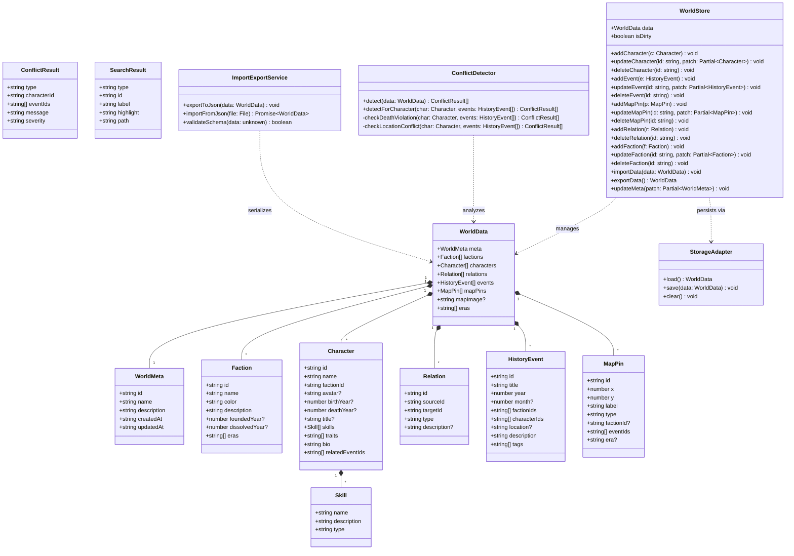
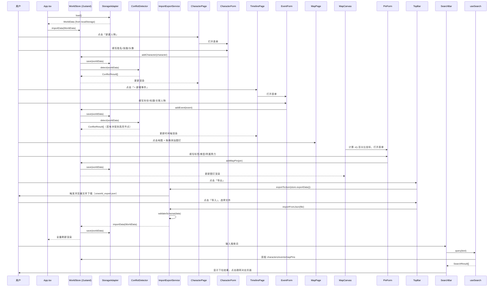
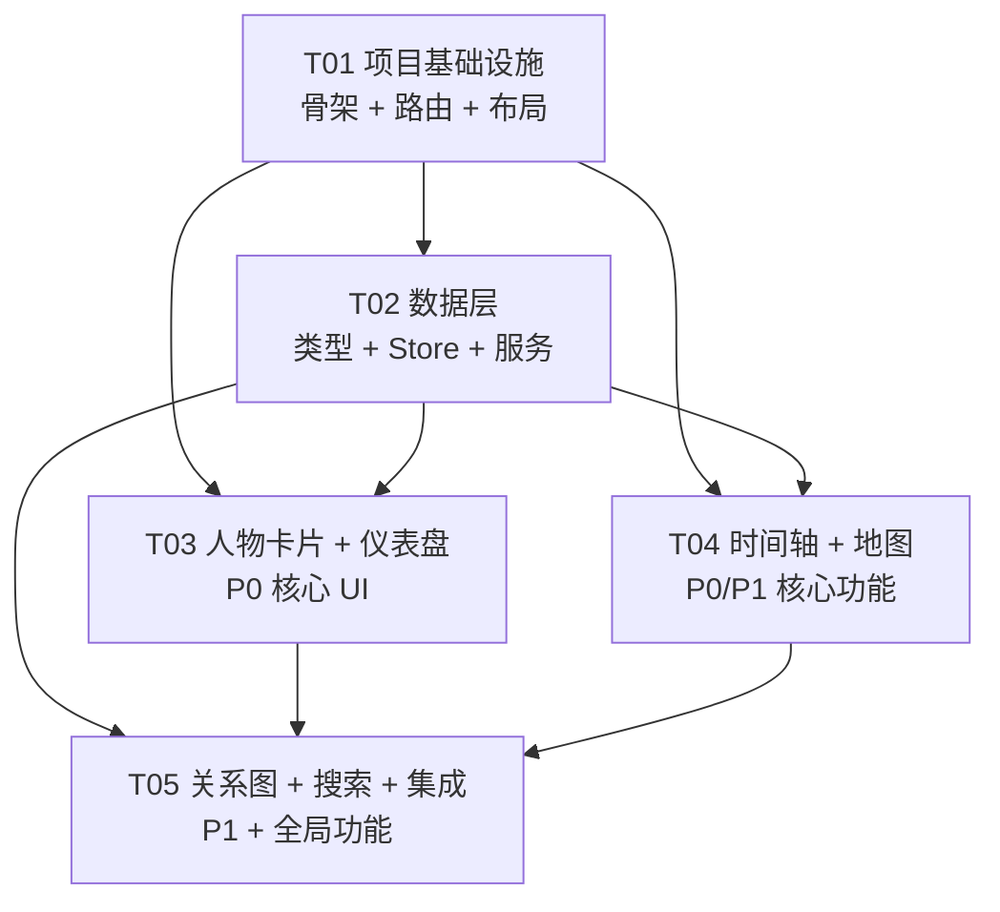

# 系统架构设计文档

**项目名**：zzworld_chronicle（「世界圣典」）  
**架构师**：高见远  
**版本**：v1.0  
**日期**：2025-07-17  

---

## Part A：系统设计

---

### 1. 技术方案与框架选型

#### 1.1 核心挑战分析

| 挑战 | 分析 |
|------|------|
| 地图交互 | 手绘图片作为背景，需支持图钉拖放、坐标百分比计算、时期图层切换 |
| 关系网络图 | 力导向图节点/边动态渲染，需处理大量连线及过滤 |
| 冲突检测 | 实时检测同角色跨事件的时间/地点矛盾，需高效遍历 |
| 本地持久化 | localStorage 单 key 存储大型数据（含 base64 图片），需压缩策略 |
| 三国杀卡片风格 | 定制化 Card 组件，含色带、技能标签、头像区等视觉元素 |

#### 1.2 框架与库选型

| 库 | 版本 | 用途 | 选型理由 |
|----|------|------|----------|
| vite | ^5.4.0 | 构建工具 | 极速 HMR，零配置 |
| react | ^18.3.0 | UI 框架 | 生态成熟，Hooks 模型 |
| react-dom | ^18.3.0 | DOM 渲染 | 标准配套 |
| @mui/material | ^5.16.0 | UI 组件库 | Dialog/Drawer/Chip 等组件开箱即用 |
| @mui/icons-material | ^5.16.0 | 图标库 | MUI 官方图标 |
| @emotion/react | ^11.13.0 | MUI 依赖 | CSS-in-JS |
| @emotion/styled | ^11.13.0 | MUI 依赖 | CSS-in-JS |
| tailwindcss | ^3.4.0 | 原子 CSS | 快速布局，与 MUI 组合使用 |
| react-force-graph-2d | ^1.25.0 | 关系网络图 | 基于 Canvas+D3-force，性能优于 SVG |
| zustand | ^4.5.0 | 状态管理 | 轻量、无 Provider 地狱，适合单页应用 |
| react-router-dom | ^6.26.0 | 路由 | SPA 路由管理 |
| uuid | ^10.0.0 | ID 生成 | RFC 4122 唯一 ID |
| fuse.js | ^7.0.0 | 全局搜索 | 轻量模糊搜索，无需服务端 |
| typescript | ^5.5.0 | 类型系统 | 强类型，提升代码质量 |

**地图模块选型说明**：选用原生 `<div>` + CSS `position: relative` 方案（非 Leaflet/Konva），原因：
- 手绘图片为静态背景，不需要地理投影
- 图钉坐标以百分比存储，天然响应式
- 避免引入重型地图库增加包体积

#### 1.3 架构模式

采用 **Feature-based 分层架构**：

```
展示层 (Pages + Components)
    ↓
业务逻辑层 (Hooks + Store)
    ↓
数据服务层 (Services)
    ↓
持久化层 (Storage Adapter)
```

- **状态管理**：Zustand（单一 `worldStore`，slices 模式）
- **数据流**：单向数据流，Store → Component，组件通过 actions 修改 Store
- **持久化**：Storage Adapter 负责 localStorage 读写，预留 D1 接口

---

### 2. 完整文件列表

```
zzworld_chronicle/
├── index.html
├── package.json
├── vite.config.ts
├── tsconfig.json
├── tsconfig.node.json
├── tailwind.config.ts
├── postcss.config.js
├── .gitignore
├── public/
│   └── favicon.svg
└── src/
    ├── main.tsx                          # 应用入口
    ├── App.tsx                           # 根组件 + 路由
    ├── types/
    │   └── index.ts                      # 全局 TypeScript 类型定义
    ├── store/
    │   ├── worldStore.ts                 # Zustand 主 Store（含所有 slices）
    │   └── searchStore.ts               # 全局搜索状态
    ├── services/
    │   ├── storageAdapter.ts            # localStorage / D1 抽象接口
    │   ├── conflictDetector.ts          # 冲突检测算法
    │   └── importExport.ts              # JSON 导入/导出服务
    ├── hooks/
    │   ├── useWorldData.ts              # 读取世界数据的统一 Hook
    │   ├── useConflicts.ts              # 冲突检测结果 Hook
    │   └── useSearch.ts                 # 全局搜索 Hook（Fuse.js）
    ├── components/
    │   ├── layout/
    │   │   ├── AppShell.tsx             # 整体布局壳（TopBar + Sidebar + Content）
    │   │   ├── TopBar.tsx               # 顶部导航栏
    │   │   └── Sidebar.tsx              # 左侧导航栏
    │   ├── common/
    │   │   ├── SearchBar.tsx            # 全局搜索框组件
    │   │   ├── ConfirmDialog.tsx        # 通用确认弹窗
    │   │   ├── EmptyState.tsx           # 空状态占位组件
    │   │   └── ConflictBadge.tsx        # 冲突警告徽章
    │   ├── character/
    │   │   ├── CharacterCard.tsx        # 三国杀风格人物卡片（展示）
    │   │   ├── CharacterForm.tsx        # 人物新建/编辑表单
    │   │   ├── CharacterDrawer.tsx      # 人物详情抽屉
    │   │   ├── SkillChip.tsx            # 技能标签 Chip 组件
    │   │   └── AvatarUploader.tsx       # 头像上传（base64 转换）
    │   ├── timeline/
    │   │   ├── TimelineCanvas.tsx       # 时间轴主画布（横向滚动）
    │   │   ├── EventNode.tsx            # 事件节点组件
    │   │   └── EventForm.tsx            # 事件新建/编辑表单
    │   ├── map/
    │   │   ├── MapCanvas.tsx            # 地图主画布容器
    │   │   ├── MapPin.tsx               # 图钉组件
    │   │   ├── PinDrawer.tsx            # 图钉信息抽屉
    │   │   └── PinForm.tsx              # 图钉新建/编辑表单
    │   ├── graph/
    │   │   ├── RelationGraph.tsx        # 力导向关系网络图
    │   │   └── GraphControls.tsx        # 图谱过滤控制栏
    │   └── dashboard/
    │       ├── StatCard.tsx             # 统计数字卡片
    │       └── RecentEditList.tsx       # 最近编辑记录列表
    └── pages/
        ├── DashboardPage.tsx            # 首页总览
        ├── MapPage.tsx                  # 世界地图
        ├── CharacterPage.tsx            # 人物卡片库
        ├── TimelinePage.tsx             # 历史时间轴
        └── GraphPage.tsx                # 关系网络图
```

---

### 3. 数据结构与接口



---

### 4. 程序调用流程



---

### 5. 待明确事项

| # | 假设/待确认 | 影响 |
|---|------------|------|
| A1 | MVP 只支持单一世界（单 `zzworld_data` localStorage key），未来多世界扩展时需修改 StorageAdapter | 数据架构 |
| A2 | 地图只有一张主背景图（base64），不支持多张地图切换 | MapPage 数据模型 |
| A3 | 冲突检测规则：①死亡年后仍参与事件；②同一人物同一年份出现在 location 字段不同的多个事件（需 location 字段有值才触发）| ConflictDetector |
| A4 | 人物头像仅支持本地图片 base64，不支持外链 URL（避免网络依赖）| AvatarUploader |
| A5 | 历史时期（eras）由用户自定义命名，存储在 `WorldData.eras` 字符串数组中 | MapPage / Timeline |
| A6 | 关系编辑入口仅在人物卡片编辑表单内，关系图拖拽连线为 P2 | RelationGraph |
| A7 | localStorage 数据量超过 5MB 时（约含 2-3 张 base64 大图），提示用户压缩图片，不做自动降级 | StorageAdapter |

---

## Part B：任务分解

---

### 6. 依赖包列表

```
dependencies:
  - react@^18.3.0: UI 框架
  - react-dom@^18.3.0: DOM 渲染
  - react-router-dom@^6.26.0: SPA 路由
  - @mui/material@^5.16.0: UI 组件库
  - @mui/icons-material@^5.16.0: MUI 图标
  - @emotion/react@^11.13.0: MUI CSS-in-JS 依赖
  - @emotion/styled@^11.13.0: MUI CSS-in-JS 依赖
  - zustand@^4.5.0: 轻量状态管理
  - react-force-graph-2d@^1.25.0: 关系力导向图（Canvas 渲染）
  - fuse.js@^7.0.0: 客户端模糊搜索
  - uuid@^10.0.0: RFC 4122 唯一 ID 生成

devDependencies:
  - vite@^5.4.0: 构建工具
  - @vitejs/plugin-react@^4.3.0: Vite React 插件
  - typescript@^5.5.0: TypeScript 编译器
  - @types/react@^18.3.0: React 类型
  - @types/react-dom@^18.3.0: ReactDOM 类型
  - @types/uuid@^10.0.0: uuid 类型
  - tailwindcss@^3.4.0: 原子 CSS
  - postcss@^8.4.0: CSS 后处理器
  - autoprefixer@^10.4.0: CSS 兼容前缀
```

---

### 7. 任务列表（按依赖顺序）

#### T01：项目基础设施

**优先级**：P0  
**依赖**：无  
**源文件**：
- `index.html`
- `package.json`
- `vite.config.ts`
- `tsconfig.json`
- `tsconfig.node.json`
- `tailwind.config.ts`
- `postcss.config.js`
- `.gitignore`
- `public/favicon.svg`
- `src/main.tsx`
- `src/App.tsx`（含路由配置和 AppShell 集成）
- `src/components/layout/AppShell.tsx`
- `src/components/layout/TopBar.tsx`
- `src/components/layout/Sidebar.tsx`

**任务描述**：搭建项目骨架，配置所有构建工具（Vite + TypeScript + Tailwind + MUI），实现带路由的 AppShell 布局（TopBar + Sidebar + 主内容区），确保 `npm run dev` 可正常运行并展示空白导航框架。

---

#### T02：数据层（类型 + 状态 + 持久化 + 工具服务）

**优先级**：P0  
**依赖**：T01  
**源文件**：
- `src/types/index.ts`（全量 TypeScript 类型定义）
- `src/store/worldStore.ts`（Zustand Store + 所有 CRUD actions）
- `src/store/searchStore.ts`（搜索状态）
- `src/services/storageAdapter.ts`（localStorage 读写 + D1 预留接口）
- `src/services/conflictDetector.ts`（冲突检测算法）
- `src/services/importExport.ts`（JSON 导入/导出服务）
- `src/hooks/useWorldData.ts`
- `src/hooks/useConflicts.ts`
- `src/hooks/useSearch.ts`

**任务描述**：实现完整数据层。类型定义覆盖所有接口（WorldData/Character/Faction/Relation/HistoryEvent/MapPin 等），Zustand Store 提供所有 CRUD actions 并在每次变更后自动持久化，冲突检测算法实现死亡年份违规和同年异地矛盾检测，导入导出支持 JSON 文件下载和 File 读取。

---

#### T03：人物卡片模块 + 首页仪表盘

**优先级**：P0  
**依赖**：T01, T02  
**源文件**：
- `src/components/character/CharacterCard.tsx`（三国杀风格卡片）
- `src/components/character/CharacterForm.tsx`（新建/编辑表单含头像上传）
- `src/components/character/CharacterDrawer.tsx`（详情抽屉）
- `src/components/character/SkillChip.tsx`
- `src/components/character/AvatarUploader.tsx`
- `src/components/common/ConfirmDialog.tsx`
- `src/components/common/EmptyState.tsx`
- `src/components/common/ConflictBadge.tsx`
- `src/components/dashboard/StatCard.tsx`
- `src/components/dashboard/RecentEditList.tsx`
- `src/pages/CharacterPage.tsx`（人物卡片库，含筛选和网格视图）
- `src/pages/DashboardPage.tsx`（首页总览仪表盘）

**任务描述**：实现人物卡片全套 CRUD UI（三国杀风格卡片网格 + 编辑表单 + 详情抽屉），支持头像上传转 base64，技能/特质标签管理，按势力筛选。首页仪表盘展示统计数字、最近编辑记录和快捷入口。

---

#### T04：历史时间轴 + 世界地图

**优先级**：P0/P1  
**依赖**：T01, T02  
**源文件**：
- `src/components/timeline/TimelineCanvas.tsx`（横向滚动时间轴）
- `src/components/timeline/EventNode.tsx`（事件节点，含冲突警告图标）
- `src/components/timeline/EventForm.tsx`（事件新建/编辑表单）
- `src/components/map/MapCanvas.tsx`（地图画布容器）
- `src/components/map/MapPin.tsx`（图钉组件，含拖拽定位）
- `src/components/map/PinDrawer.tsx`（图钉信息抽屉）
- `src/components/map/PinForm.tsx`（图钉新建/编辑表单）
- `src/pages/TimelinePage.tsx`（时间轴页面）
- `src/pages/MapPage.tsx`（地图页面，含时期切换）

**任务描述**：时间轴实现横向滚动布局、事件 CRUD、冲突节点红色警告图标（复用 ConflictDetector 结果）。地图模块实现背景图上传、图钉拖放（百分比坐标）、图钉 CRUD、时期图层切换（显示/隐藏逻辑）。

---

#### T05：关系网络图 + 全局搜索 + 集成调试

**优先级**：P1  
**依赖**：T01, T02, T03, T04  
**源文件**：
- `src/components/graph/RelationGraph.tsx`（react-force-graph-2d 渲染）
- `src/components/graph/GraphControls.tsx`（过滤控制栏）
- `src/components/common/SearchBar.tsx`（全局搜索框 + 结果下拉）
- `src/pages/GraphPage.tsx`（关系网络图页面）

**任务描述**：实现 react-force-graph-2d 力导向图（节点=人物头像、边=关系类型，支持按势力过滤、点击节点高亮）；全局搜索框集成 Fuse.js 跨人物/事件/地点检索并跳转；TopBar 集成导入/导出按钮；端到端联调所有模块，确保数据一致性。

---

### 8. 共享知识（Cross-cutting Concerns）

#### 命名规范
- 文件名：PascalCase（组件）、camelCase（hooks/services/utils）
- 类型接口：`interface XxxType`，导出于 `src/types/index.ts`
- Store actions：动词 + 名词（`addCharacter`、`updateEvent`、`deleteMapPin`）
- 路由路径：`/`（总览）、`/map`、`/characters`、`/timeline`、`/graph`

#### 状态管理约定
- 唯一 Store 文件：`src/store/worldStore.ts`，使用 Zustand `create` + `immer` 中间件
- 每次 action 执行后自动调用 `storageAdapter.save(state.data)` 持久化
- 组件通过 `useWorldData` hook 读取数据，**不直接引用** store 内部结构
- 冲突检测结果存于 store 的 `conflicts: ConflictResult[]` 字段，每次 save 后重算

#### 样式约定
- MUI 组件用于交互元素（Button/Dialog/Drawer/TextField/Chip 等）
- Tailwind 用于布局和间距（`flex`、`gap-*`、`p-*`、`w-*`）
- 三国杀卡片样式：使用 MUI `Card` + Tailwind 自定义，左侧色带通过 `border-l-4` 实现，颜色取 `faction.color`
- 主题色：参考三国杀古典风，主色 `#8B4513`（深棕）、强调色 `#C0392B`（战旗红）

#### ID 生成
- 所有实体 ID 统一使用 `uuid()` 生成（`import { v4 as uuid } from 'uuid'`）

#### 日期存储
- 所有时间戳（createdAt/updatedAt）存储为 ISO 8601 UTC 字符串
- 历史年份（birthYear/deathYear/event.year）存储为 `number`（整数年份）

#### localStorage 约定
- 数据 Key：`zzworld_data`（单 key 存储完整 `WorldData` JSON）
- 读取时：`JSON.parse(localStorage.getItem('zzworld_data') || 'null')`
- 写入时：`localStorage.setItem('zzworld_data', JSON.stringify(data))`
- 首次加载若 key 不存在：初始化 `DEFAULT_WORLD_DATA`

#### D1 预留接口
```typescript
interface IStorageAdapter {
  load(): Promise<WorldData | null>;
  save(data: WorldData): Promise<void>;
  clear(): Promise<void>;
}
// LocalStorageAdapter 和未来的 D1Adapter 均实现此接口
```

#### 冲突检测规则（确定实现）
1. **死亡后出现**：`character.deathYear` 不为空，且存在 `event.year > character.deathYear` 的事件包含该人物
2. **同年异地矛盾**：同一人物同一年份参与了 2 个以上 `event.location` 字段不同且均有值的事件

#### base64 图片约定
- 头像图片：上传后压缩至最大 200×200px（Canvas resize），再转 base64 存入 `character.avatar`
- 地图背景图：上传后压缩至最大 2000×2000px，存入 `worldData.mapImage`
- 建议图片 MIME 类型：`image/jpeg`（压缩率更高）

---

### 9. 任务依赖图



---

*文档版本 v1.0 · 架构师：高见远 · 2025-07-17*
